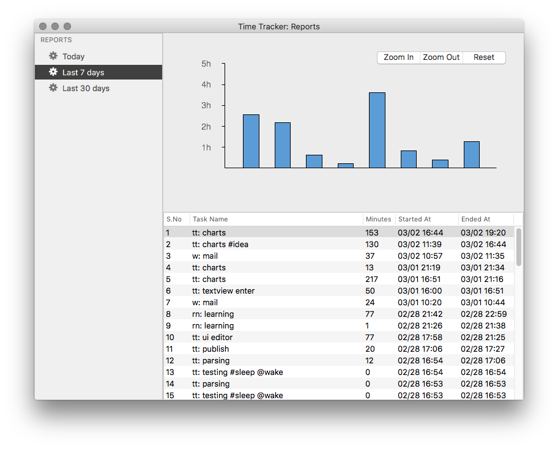

## TimeTracker

An utility app for mac, accept you current task (free text), and keep a timer to log the minutes you spent on task.

Suggested syntax: ProjName: Taskname #task #type

eg., 
    `tt: prepare task list #doc`
    `tt: demo video #demo`

### Feature

* Minimal UI
* Always on top (to keep you focused)
* Simple report

### Demo

#### Note:

* For demo/testing purpose, this demo build 5 second timer. So ignore the hh:mm calculations
* App not optimized for multiple monitor, hence I was drag/droping from different screen in demo
    

### Screenshots

* Input
* Minimized
* Report

### Download

[Download Latest v0.9.4(beta)](https://github.com/palaniraja/timetracker/releases/latest)

### OSX Mojave - Dark mode users

App doesn't play well with Dark mode when editing the task. Till I update the app, you may temporarily run the below command in your terminal.app to use the app in dark mode.

`defaults write com.palaniraja.timetracker.TimeTracker NSRequiresAquaSystemAppearance -bool yes`

### Release notes

Refer releases page - https://github.com/palaniraja/timetracker/releases

### Credits

[App Icon](https://www.iconfinder.com/icons/1055090/clock_time_timer_icon#size=128) - [Nick Roach](http://www.elegantthemes.com/)
