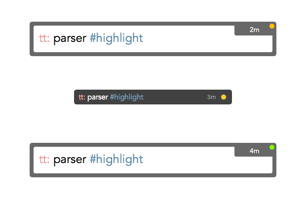

## TimeTracker

An utility app for mac, accept you current task (free text), and keep a timer to log the minutes you spent on task.

Suggested syntax: ProjName: Taskname #task #type

eg., 
    `tt: prepare task list #doc`
    `tt: demo video #demo`

### Feature

* Minimal UI
* Always on top (to keep you focused)
* Simple report

### Demo

#### Note:

* For demo/testing purpose, this demo build 5 second timer. So ignore the hh:mm calculations
* App not optimized for multiple monitor, hence I was drag/droping from different screen in demo
    

### Screenshots

* Input
* Minimized
* Report

### Download

V0.5 (alpha) - https://goo.gl/cs2qw5

### Release notes

##### v0.7 (2017-02-28)
* Pause indicator
* Token parsing & highlighting
* Pause timer when system goes to sleep and resume when system awake

##### v0.5 (2017-02-26)
* Initial version
* Full/Mini view
